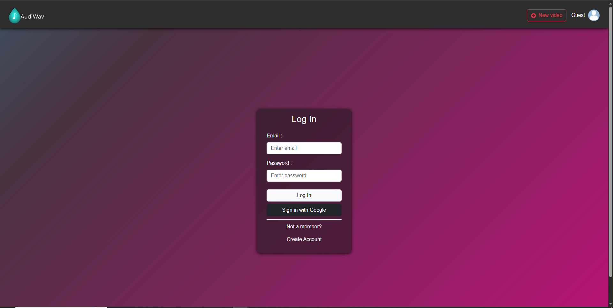
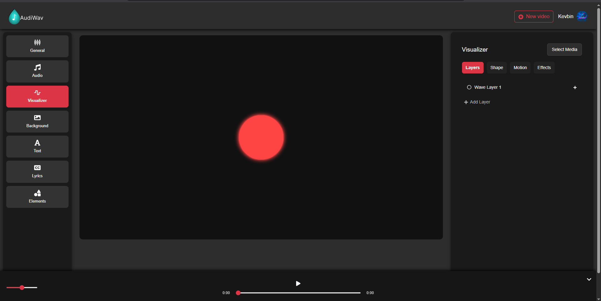
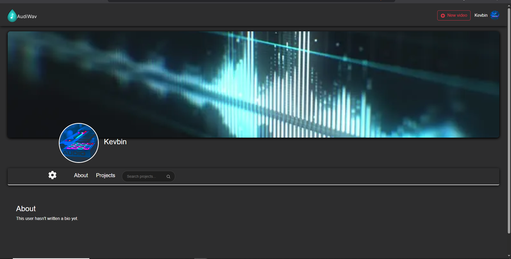

# 🎧 Audiwav

**Audiwav** is a SaaS web application in active development, built for content creators, musicians, and streamers to generate professional audio visualizers using their own uploaded tracks.

Inspired by platforms like **Specterr** and **Vizzy.io**, Audiwav aims to provide a modern, mobile-friendly, and affordable alternative for creators.

> 🚧 **Note:** Audiwav is currently under development. Core features like real-time visualizer customization and audio rendering are still being built. However, user authentication, profile management, and cloud-based project storage are fully functional.

---

## 🚀 Core Features (So Far)

- 🔐 **User Authentication & Authorization** via Firebase
- 🧑‍🎨 **User Profiles** with support for uploaded visualizer projects
- ☁️ **Firestore Integration** for storing user data and project metadata
- 📁 **Firebase Storage** for handling music file uploads
- 📱 **Responsive UI** built for both desktop and mobile
- 💻 **Built with React + PixiJS** for future visualizer rendering

---

## 🛠️ Tech Stack

- **Frontend:** React, PixiJS, Bootstrap
- **Backend:** Firebase (Auth, Firestore, Storage)
- **Other:** Web Audio API, GSAP

---

## 📸 Screenshots

### 🔐 Login Page

### 🎨 Visualizer Editor

### 🧑‍🎨 User Profile

---

## 📦 Roadmap

- 🎞️ Video export functionality using FFmpeg
- 🎨 Real-time visualizer rendering and shape animation
- 💎 Visualizer presets + customization marketplace
- 💰 Premium SaaS subscription tier

---

## ⚠️ **License Notice**

Audiwav is **not open source**. This repository is public for demonstration and evaluation purposes only.  
Cloning for educational or employer review is allowed.  
**Reuse, modification, or redistribution is strictly prohibited.**

---

## 👤 Author

Made by **Kevin Barany**  
[🔗 LinkedIn](https://www.linkedin.com/feed/) • [🌐 Portfolio](https://kevdev-portfolio.netlify.app/home)
